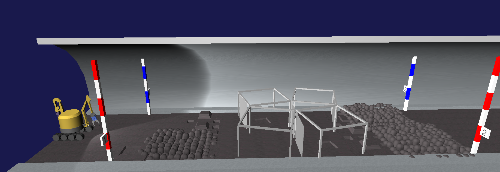
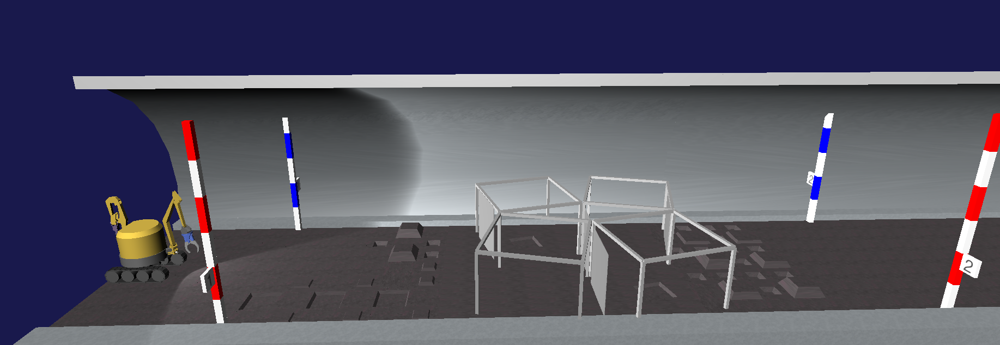
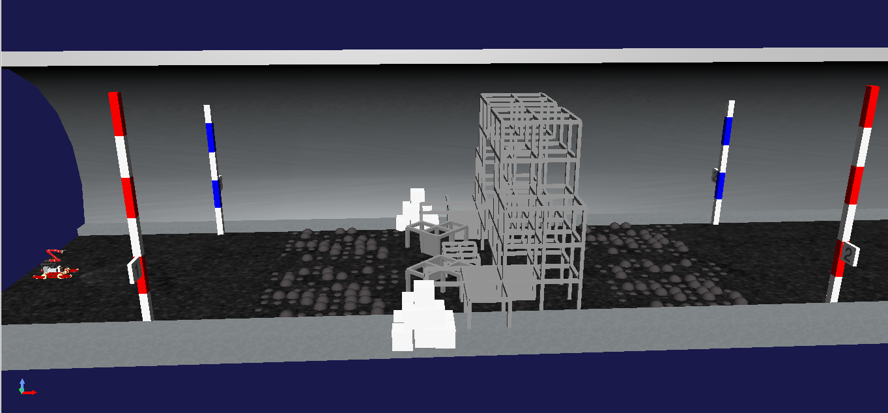
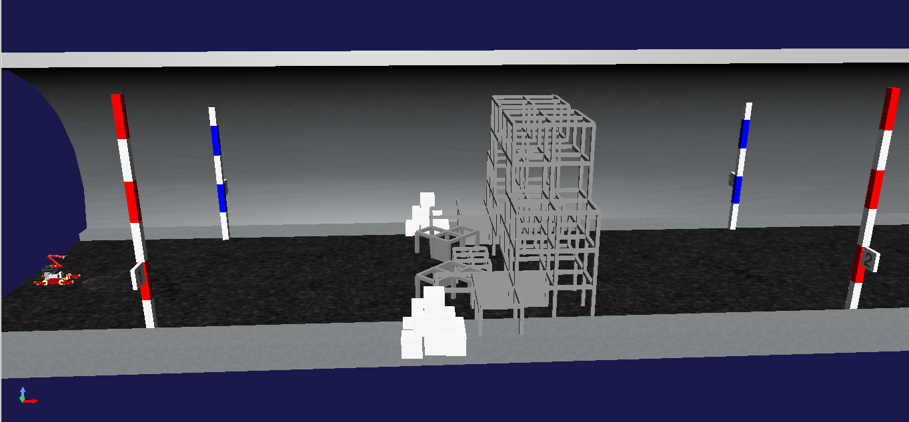
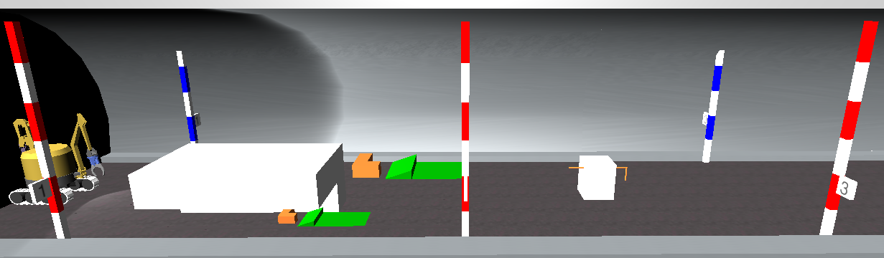

# uoa2020sg   
We designed uoa2020sg by referring to [WRS-TDRRC-2020SG1](https://github.com/WRS-TDRRC/WRS-TDRRC-2020SG1).
## Background and Objective
追記お願いします．

## SOFTWARE IMPORTANT INFORMATION 
### ABOUT Choreonoid  
Version 1.8 with a tag specified by the development version management.  
EX.) git clone -b tag https://github.com/choreonoid/choreonoid.git  
  
### ABOUT Robotic middle-ware  
 * Recommend using ROS1 Melodic  
We have got information that the choreonoid developer will support the connection between choreonoid and ROS1.  
  
 * Not recommend using OpenRTM  
We got information that the choreonoid developer does not have any plan to support the connection between choreonoid and RTM.  
There is information that the RTM version 1.1.2 and 1.2.0 were used with older choreonoid. But there is no information on whether the choreonoid developer will support.  
  
### ABOUT AGX Dynamics  
We are considering a suitable virsion of AGX.  
Currently, Version 2.23.0.4 which was nearest version for Ubuntu 18.04 from WRS2018 and verified by the committee.  
We recomend version 2.29.0.0 and verified it by the comittiee. 

## Requirements  

  1. [Choreonoid](https://choreonoid.org/en/manuals/latest/index.html), [Installing Choreonoid](https://choreonoid.org/en/manuals/latest/install/build-ubuntu.html#development-version). If you use ROS melodic, see also [Teleoperation Sample using ROS](https://choreonoid.org/en/manuals/latest/wrs2018/teleoperation-ros.html)  
  2. [AGX for Choreonoid](https://choreonoid.org/en/manuals/latest/agxdynamics/index.html), [Downloading AGX](https://www.algoryx.se/download/?id=1887), [Installing AGX](https://www.algoryx.se/documentation/complete/agx/tags/latest/UserManual/source/installation.html#install-on-ubuntu-16-04). The AGX highest version is 2.29.0.0 which was nearest version for Ubuntu 18.04. There are capability that higher version which can be used will be found.  

## How to use this repository.  
If you have to install choreonoid now, please follow below commands:  

    $ cd ~  
    $ git clone https://github.com/choreonoid/choreonoid.git  
    $ ~/choreonoid/misc/script/install-requisites-ubuntu-18.04.sh  
    $ sudo apt-get install qt5-default libqt5x11extras5-dev qt5-style-plugins  
    $ cd ~/choreonoid/ext  
    $ git clone https://github.com/uoa-ws2020/uoa2020sg.git 
    $ cd ~/choreonoid && mkdir build && cd build  
    $ cmake .. -DBUILD_AGX_DYNAMICS_PLUGIN=ON -DBUILD_AGX_BODYEXTENSION_PLUGIN=ON -DBUILD_COMPETITION_PLUGIN=ON -DENABLE_CORBA=ON -DBUILD_CORBA_PLUGIN=ON -DBUILD_MULTICOPTER_PLUGIN=ON -DBUILD_MULTICOPTER_SAMPLES=ON -DBUILD_SCENE_EFFECTS_PLUGIN=ON -DBUILD_WRS2018=ON -DUSE_PYTHON3=OFF
    $ make -j4
  
Or you are already using choreonoid, please follow below commands:  
(When your choreonoid is under ~/choreonoid)  

    $ cd ~/choreonoid/ext  
    $ git clone https://github.com/uoa-ws2020/uoa2020sg.git 
    $ cd ~/choreonoid/build  
    $ cmake .. -DBUILD_AGX_DYNAMICS_PLUGIN=ON -DBUILD_AGX_BODYEXTENSION_PLUGIN=ON -DBUILD_COMPETITION_PLUGIN=ON -DENABLE_CORBA=ON -DBUILD_CORBA_PLUGIN=ON -DBUILD_MULTICOPTER_PLUGIN=ON -DBUILD_MULTICOPTER_SAMPLES=ON -DBUILD_SCENE_EFFECTS_PLUGIN=ON -DBUILD_WRS2018=ON -DUSE_PYTHON3=OFF 
    $ make -j4

Before run, you have to add "source /opt/Algoryx/AgX-"Version"/setup_env.bash" at the end of ~/.bashrc , and reopen the terminal.
e.g. "source /opt/Algoryx/AgX-2.29.0.0/setup_env.bash" (when you use version 2.29.0.0)
Please find further details(field images, run scripts, and some attentions related the stage gate rules) in the [wiki page](https://github.com/uoa-ws2020/uoa2020sg/wiki).  

## The location of the simulation log files  
After running a simulation, you can find a simulation log file under ~/choreonoid/ext/uoa2020sg/project.  
Please see also [Choreonoid documentation](https://choreonoid.org/en/manuals/1.7/simulation/execution-and-playback.html).  

## Q&A 
If you have any questions or anything, plase feel free contact us. 
Contact Address: uoa-ws2020@u-aizu.ac.jp

Edited: 29th Sep. 2020

Welcome to the uoa2020sg wiki!

# IMPORTANT ATTENTIONS RELATED THE STAGE GATE RULES!  
You should read this section before trying the stage gate.  
1. You have to record videos from start to finish each task. In addition, you also have to show the elapsed time in the video.
2. You have to choose suitable stage gate fields for your robot which you want to assess. Please check the following table to know which stage gate model should be used to assess your robot.  
3. You have to assess your all robots which you will use in the competition. This is meaning that you have to assess a robot again when you modified the robot, for example changing the size of robot, adding or changing arms, legs, wheels, crawlers, and other important things for effecting the real time factor of the simulator.   
4. You have to assess also any additional tools which your robot will use in the competition. This is meaning that you have to assess a tool again when you modified the tool.  

Table: The relations between robots and the stage gate fields(In the table, "V" means suitable combination).  

| Field model name | Large size robot(Ex.:DoubleArmV7) | Middle and small size robot(Ex.:AizuSpider) | Multi-copter(Ex.:Quadcopter) |  
| :-   | :-:  | :-:  | :-:  |
| SG1L |  V   |  -   |  -   |
| SG1M |  -   |  V   |  V   |
| SG2  |  V   |  V   |  -   |

## Operation Type
The operation type indicates the control system of a robot and is classified into the following three types.
### A: Autonoumous
A control system that performs behaviors or tasks with a degree of autonomy (without external influence).
### B: Semi-autonoumous
A control system that operate autonomously and also by a person.
### C: Remote control
A control system that operated by a person.

## SG1L  
Choose either A or B and execute the task. 
### A: With capsule terrain
### Field Image  
  
Colors may vary.  
### Python Script
    $ ~/choreonoid/build/bin/choreonoid ~/choreonoid/ext/uoa2020sg/script/SG1L-Capsule-DoubleArmV7A.py  

### B: Without capsule terrain
### Field Image 
  
Colors may vary.  
### Python Script 
    $ ~/choreonoid/build/bin/choreonoid ~/choreonoid/ext/uoa2020sg/script/SG1L-DoubleArmV7A.py  

## SG1M  
Choose either A or B and execute the task. 
### A: With capsule terrain
### Field Image  
  
Colors may vary.  

### Python Script1  
    $ ~/choreonoid/build/bin/choreonoid ~/choreonoid/ext/uoa2020sg/script/SG1M-Capsule-AizuSpiderSA.py  

### Python Script2  
    $ ~/choreonoid/build/bin/choreonoid ~/choreonoid/ext/uoa2020sg/script/SG1M-Capsule-Quadcopter.py  

### B: Without capsule terrain
### Field Image  
  
Colors may vary.  

### Python Script1  
    $ ~/choreonoid/build/bin/choreonoid ~/choreonoid/ext/uoa2020sg/script/SG1M-AizuSpiderSA.py  

### Python Script2  
    $ ~/choreonoid/build/bin/choreonoid ~/choreonoid/ext/uoa2020sg/script/SG1M-Quadcopter.py  

## SG2  
### Field Image  
  
Colors may vary.  

### Sample movies to show removing an obstacle pushing over a slope by each size robot.  
1. Removing the obstacle by a large size robot: [mp4(7.7MB)](wiki/img/SG2-RemovingObstacle-LargeRobot.mp4)
2. Removing the obstacle by a middle size robot: [mp4(26MB)](wiki/img/SG2-RemovingObstacle-MiddleRobot.mp4)

### Sample movies to show how to remove the angled rod correctly.  
1. Removing the angled rod by a large size robot: [mp4(5.7MB)](wiki/img/SG2-RemovingAngledRod-LargeRobot.mp4)
2. Removing the angled rod by a middle size robot: [mp4(13MB)](wiki/img/SG2-RemovingAngledRod-MiddleRobot.mp4)

### Python Script  
    $ ~/choreonoid/build/bin/choreonoid ~/choreonoid/ext/uoa2020sg/script/SG2-DoubleArmV7A.py  

## Submission Requirements 
Requirements  
A. URL for videos about SG1 and SG2. (Please use video sharing service like Youtube.)  
B. Information the operation type for the robot (autonomous, semi-autonomous or remote control).

You have to submit A and B to us.

## Important date
Submission deadline: October 23, 2020

## Q&A 
If you have any questions or anything, plase feel free contact us. 
Contact Address: uoa-ws2020@u-aizu.ac.jp

Edited: 29th Sep. 2020

